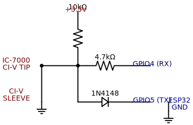
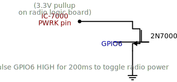
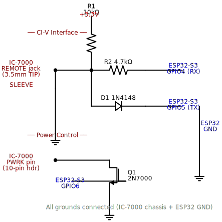

# ESP32-S3 Headless Controller for Icom IC-7000

**Replace a stolen or broken IC-7000 control head with an ESP32-S3 and control your radio from any phone or computer.**

The Icom IC-7000 is an HF/VHF/UHF all-mode transceiver with a detachable control head. If the head is lost, stolen, or broken, the radio becomes a paperweight — until now. This project uses an ESP32-S3 connected to the radio's CI-V port to provide full remote control via a web browser or Home Assistant, with no original head unit required.

## The Radio

| | |
|---|---|
|  |  |
| Front panel (head attached) | Rear panel — CI-V jack is labeled REMOTE |

> **See [docs/HARDWARE_REFERENCE.md](docs/HARDWARE_REFERENCE.md) for detailed connector pinouts, pogo pin identification, and all rear panel diagrams.**


---

## How It Works

The IC-7000 main body has two key interfaces on the rear panel:

1. **CI-V Port** (3.5mm mono jack) — Icom's serial control protocol. Supports reading and setting frequency, mode, power level, PTT, S-meter, and more.
2. **10-pin head connector** — Carries power, ground, composite video, and a bidirectional serial bus to the control head's sub-CPU.

The critical discovery: **the head's only role in power-on is grounding the PWRK line.** The PWRK pin has a 3.3V pullup on the logic board. When the power button on the head is pressed, it simply grounds this pin momentarily. The main CPU sees the low signal and energizes the main relay to boot the radio. No handshake, no protocol — just a wire to ground.

Once powered on, CI-V provides full control. The head is not needed for any radio function after boot.

**Source:** [Fixing a dead Icom IC-7000 — detailed power-on circuit analysis](https://www.danplanet.com/blog/2021/07/11/fixing-a-dead-icom-ic-7000/)

---

## Features

- **Power on/off** via PWRK pin pulse (momentary ground)
- **Frequency control** — set/read any frequency across HF/VHF/UHF
- **Mode selection** — LSB, USB, AM, CW, RTTY, FM, WFM, CW-R, RTTY-R
- **PTT control** — transmit/receive via CI-V command
- **S-Meter reading** — real-time signal strength
- **Preset buttons** — quick access to common frequencies (2m calling, 70cm, 20m SSB, marine Ch16, FRS, etc.)
- **Web interface** — control from any phone/tablet/computer on the local network
- **Home Assistant integration** — full HA entity support via ESPHome native API
- **ESPHome OTA updates** — update firmware over WiFi

---

## Hardware Required

| Component | Description | ~Cost |
|-----------|-------------|-------|
| ESP32-S3 dev board | Any S3 devkit (e.g. ESP32-S3-DevKitC-1) | $8 |
| 4.7kΩ resistor | CI-V RX series protection | $0.01 |
| 1N4148 diode | CI-V TX open-drain isolation | $0.05 |
| 10kΩ resistor | CI-V bus pullup to 3.3V | $0.01 |
| 3.5mm mono plug | Connects to IC-7000 CI-V jack | $1 |
| Momentary push button | Optional: manual power-on backup | $0.25 |
| 2N7000 N-MOSFET | Optional: ESP32-controlled power-on | $0.30 |
| **Total** | | **~$10** |

---

## Wiring Diagram

### CI-V Interface




The CI-V bus is a half-duplex, open-drain serial bus at TTL levels. RX and TX share a single wire (the 3.5mm tip). We use a diode to isolate the TX pin so the ESP32 can both read and write.

```
IC-7000 REAR PANEL                          ESP32-S3
CI-V Jack (3.5mm mono)                      Dev Board
━━━━━━━━━━━━━━━━━━━━                        ━━━━━━━━

                    10kΩ pullup
                    to 3.3V
                       │
  TIP ────────────────┬┴────── 4.7kΩ ──────── GPIO4 (RX)
  (CI-V data)         │
                      └─── ◄── 1N4148 ─────── GPIO5 (TX)
                           (cathode toward
                            ESP32 TX pin)

  SLEEVE ─────────── GND ─────────────────── GND
  (ground)
```

**How it works:**
- **RX (GPIO4):** The 4.7kΩ resistor protects the ESP32 input. It reads whatever the radio sends on the CI-V bus.
- **TX (GPIO5):** The 1N4148 diode acts as an open-drain output. When GPIO5 goes LOW, current flows through the diode pulling the bus LOW. When GPIO5 goes HIGH, the diode blocks, and the 10kΩ pullup brings the bus back HIGH.
- **10kΩ pullup:** Keeps the CI-V bus at 3.3V when idle.

### Power-On Circuit (PWRK)




The PWRK pin on the IC-7000's 10-pin head connector has a 3.3V pullup on the radio's logic board. Grounding it momentarily (200ms) triggers power-on.

**Option A: Manual button only**
```
IC-7000 10-PIN CONNECTOR

  PWRK pin ──────── momentary button ──────── GND pin
```

**Option B: ESP32-controlled power-on (recommended)**
```
IC-7000 10-PIN CONNECTOR              ESP32-S3

  PWRK pin ──────── DRAIN
                      │
                    2N7000
                    N-MOSFET
                      │
  GND pin ────────── SOURCE
                      │
                     GATE ──── GPIO6
```

When GPIO6 goes HIGH, the MOSFET conducts, grounding PWRK. The ESP32 pulses GPIO6 HIGH for 200ms then LOW.

### Complete System




```
                    ┌──────────────────────────┐
                    │      IC-7000 BODY         │
                    │       (no head)           │
                    │                           │
  DC 13.8V ────────┤ DC IN                     │
                    │                           │
                    │ CI-V (3.5mm) ──── tip ────┼──────────┐
                    │                  slv ─────┼──── GND  │
                    │                           │          │
                    │ 10-PIN HEAD CONNECTOR     │          │
                    │   PWRK ───────────────────┼────┐     │
                    │   GND ────────────────────┼──┐ │     │
                    └──────────────────────────┘  │ │     │
                                                   │ │     │
                    ┌──────────────────────────┐  │ │     │
                    │      ESP32-S3            │  │ │     │
                    │                          │  │ │     │
           USB-C ───┤ 5V / Power               │  │ │     │
                    │                          │  │ │     │
                    │ GPIO4 (RX) ◄── 4.7kΩ ────┼──┼─┼─────┘
                    │ GPIO5 (TX) ──► 1N4148 ───┼──┘ │
                    │               10kΩ ↑3.3V │    │
                    │                          │    │
                    │ GPIO6 ──► 2N7000 GATE    │    │
                    │            DRAIN ────────┼────┘
                    │            SOURCE ── GND │
                    │                          │
                    │ GND ─────────────────────┼── common GND
                    │                          │
                    │ WiFi )) ─── phone/HA     │
                    └──────────────────────────┘
```

---

## Finding the PWRK Pin

The IC-7000's 10-pin head connector uses pogo pins. You need to identify which pin is PWRK and which is GND.

**Method (multimeter):**

1. Connect DC power to the radio (don't press anything — no head attached)
2. Set multimeter to DC voltage
3. Black probe on chassis ground
4. Touch red probe to each of the 10 pogo pins
5. You're looking for:
   - **GND pins** — 0V (there will be multiple)
   - **~3.3V pin** — this is likely PWRK (pulled up by the logic board)
   - **~13.8V pin** — power supply to head (don't use this)
   - **Composite video** — may show fluctuating voltage
6. The 3.3V pin is PWRK. Briefly touch it to ground with a wire — if the radio powers on (relay clicks, fans spin), that's it.

**Reference:** The IC-7000 service manual (Section 9, Wiring Diagram) has the complete pinout. The PWRK signal originates from the logic unit's sub-CPU with a pullup to the 3.3V rail.

---

## CI-V Protocol Reference

### Frame Format

All CI-V messages follow this structure:

```
FE FE [TO] [FROM] [CMD] [SUB] [DATA...] FD

FE FE    = preamble (2 bytes)
TO       = destination address (IC-7000 = 0x70)
FROM     = controller address (0xE0)
CMD      = command number
SUB      = sub-command (optional)
DATA     = command data (optional)
FD       = end of message
```

### Response Codes

```
FB = OK (ACK)
FA = Error (NAK)
```

### IC-7000 CI-V Address

The IC-7000 default CI-V address is **0x70**. This can be changed in the radio's menu (Menu → Set → CI-V → CI-V Address).

Default baud rate: **19200** (can be changed to 300, 1200, 4800, 9600)

### Command Reference (IC-7000 supported)

| Cmd | Sub | Direction | Function | Data Format |
|-----|-----|-----------|----------|-------------|
| 0x00 | — | To radio | Set frequency (transceive) | 5 bytes BCD, LSB first |
| 0x03 | — | To radio | Read operating frequency | No data; radio responds with freq |
| 0x04 | — | To radio | Read operating mode | No data; radio responds with mode |
| 0x05 | — | To radio | Set operating frequency | 5 bytes BCD, LSB first |
| 0x06 | — | To radio | Set operating mode | 1 byte mode + 1 byte filter |
| 0x07 | 0x00 | To radio | Select VFO A | — |
| 0x07 | 0x01 | To radio | Select VFO B | — |
| 0x07 | 0xA0 | To radio | VFO A = VFO B | — |
| 0x07 | 0xB0 | To radio | VFO A ↔ VFO B swap | — |
| 0x08 | — | To radio | Select memory mode | — |
| 0x09 | — | To radio | Memory write | — |
| 0x0A | — | To radio | Memory to VFO | — |
| 0x0B | — | To radio | Memory clear | — |
| 0x0F | — | To radio | Split ON (0x01) / OFF (0x00) | 1 byte |
| 0x14 | 0x01 | To radio | Set/read AF gain | 2 bytes BCD (0000-0255) |
| 0x14 | 0x02 | To radio | Set/read RF gain | 2 bytes BCD (0000-0255) |
| 0x14 | 0x03 | To radio | Set/read squelch | 2 bytes BCD (0000-0255) |
| 0x14 | 0x0A | To radio | Set/read TX power | 2 bytes BCD (0000-0255) |
| 0x14 | 0x0B | To radio | Set/read MIC gain | 2 bytes BCD (0000-0255) |
| 0x15 | 0x02 | To radio | Read S-meter | Response: 2 bytes BCD (0000-0255) |
| 0x15 | 0x11 | To radio | Read power meter | Response: 2 bytes BCD |
| 0x15 | 0x12 | To radio | Read SWR meter | Response: 2 bytes BCD |
| 0x16 | 0x02 | To radio | Set/read preamp | 0x00=OFF, 0x01=ON |
| 0x16 | 0x12 | To radio | Set/read AGC | 0x01=Fast, 0x02=Mid, 0x03=Slow |
| 0x16 | 0x22 | To radio | Set/read noise blanker | 0x00=OFF, 0x01=ON |
| 0x16 | 0x44 | To radio | Set/read duplex | 0x00=OFF, 0x01=-, 0x02=+ |
| 0x1A | 0x05 | To radio | Read/write memory contents | Various |
| 0x1C | 0x00 | To radio | Set/read TX state (PTT) | 0x00=RX, 0x01=TX |

### Mode Codes

| Code | Mode |
|------|------|
| 0x00 | LSB |
| 0x01 | USB |
| 0x02 | AM |
| 0x03 | CW |
| 0x04 | RTTY |
| 0x05 | FM |
| 0x06 | WFM |
| 0x07 | CW-R |
| 0x08 | RTTY-R |

### Filter Codes

| Code | Filter |
|------|--------|
| 0x01 | Wide |
| 0x02 | Medium |
| 0x03 | Narrow |

### BCD Frequency Encoding

Frequencies are encoded as 5 bytes of BCD (Binary Coded Decimal), least significant byte first. Each byte contains two BCD digits.

Example: **14.250.000 Hz** (14.250 MHz)
```
Decimal: 0 1 4 2 5 0 0 0 0 0
Bytes:   00 00 25 41 00  (paired, LSB first)

Sent as: FE FE 70 E0 05 00 00 25 41 00 FD
```

Example: **146.520.000 Hz** (146.520 MHz)
```
Decimal: 1 4 6 5 2 0 0 0 0 0
Bytes:   00 00 20 65 41  (paired, LSB first)

Sent as: FE FE 70 E0 05 00 00 20 65 41 FD
```

---

## Web Interface

The ESP32 hosts a built-in web server. No app install needed, just open a browser.

### ESPHome Web Server (direct access via phone/computer)


*The ESPHome web interface shows all sensors, switches, and buttons. Click any sensor to see a history graph.*

### Sensor History Graphs


*Click on any sensor (frequency, S-meter) to see real-time graphing.*

### What You See on Your Phone

Open the ESP32 IP in your browser to get:

| Section | What it shows |
|---------|--------------|
| **Sensors** | Current frequency (Hz), S-meter level, PTT state, mode (USB/FM/CW) |
| **Switches** | PTT on/off toggle, Radio Power toggle |
| **Buttons** | Frequency presets (2m calling, 70cm, 20m SSB, 40m SSB, FRS, Marine Ch16) |
| **Buttons** | Mode selectors (USB, LSB, FM, AM, CW) |
| **Status** | WiFi signal strength, uptime, IP address |

### Home Assistant Dashboard

When connected to Home Assistant, all entities auto-discover. Build custom dashboards with frequency gauges, S-meter graphs, PTT buttons, band presets, and power controls. Full radio control from the HA mobile app.

---

## Software Setup

### Prerequisites

- [ESPHome](https://esphome.io/) installed (via Home Assistant add-on or standalone)
- WiFi network accessible from the radio's location

### Configuration

1. Clone this repository:
   ```bash
   git clone https://github.com/gbroeckling/esp32-ic7000.git
   cd esp32-ic7000
   ```

2. Edit `secrets.yaml` with your WiFi credentials:
   ```yaml
   wifi_ssid: "YourNetworkName"
   wifi_password: "YourPassword"
   api_key: "your-api-encryption-key"
   ```

3. Flash the ESP32-S3:
   ```bash
   esphome run ic7000.yaml
   ```

4. The ESP32 will connect to WiFi and be available at:
   - **Web UI**: http://192.168.1.60 (or configured IP)
   - **Home Assistant**: auto-discovered via ESPHome integration

### Frequency Presets

The default config includes presets for common frequencies. Edit `ic7000.yaml` to add your own:

```yaml
button:
  - platform: template
    name: "My Repeater"
    on_press:
      - lambda: |-
          id(ic7000).set_frequency(147060000);  // 147.060 MHz
          id(ic7000).set_mode(5);               // FM
```

---

## IC-7000 Specifications

| Spec | Value |
|------|-------|
| Frequency range | HF (0.03–60 MHz), VHF (118–174 MHz), UHF (420–450 MHz) |
| Modes | LSB, USB, AM, CW, RTTY, FM, WFM |
| TX power | HF: 100W, VHF: 50W, UHF: 35W |
| CI-V address | 0x70 (default) |
| CI-V baud | 19200 (default) |
| CI-V connector | 3.5mm mono jack (rear panel) |
| Head connector | 10-pin pogo (proprietary) |
| Power | 13.8V DC |

---

## References

- [Fixing a dead Icom IC-7000 — PWRK power-on circuit](https://www.danplanet.com/blog/2021/07/11/fixing-a-dead-icom-ic-7000/)
- [CIVmasterLib — Arduino/ESP32 CI-V library](https://github.com/WillyIoBrok/CIVmasterLib)
- [CI-V hardware interface schematic](https://werner.rothschopf.net/microcontroller/202102_arduino_antennaswitch_civ_en.htm)
- [DM5AL SKT-7000 separation kit (reference)](https://dm5al.de/?page_id=241)
- [IC-7000 Instruction Manual](https://icomuk.co.uk/files/icom/PDF/productManual/IC-7000man.pdf)
- [IC-7000 Service Manual](https://www.arcticpeak.com/files/ICOM_IC-7000_Service_Manual.pdf)
- [Arduino CI-V S-Meter project](https://projecthub.arduino.cc/ddufault/external-s-meter-on-icom-radios-with-ci-v-port-e9fdd9)
- [ESPHome UART component](https://esphome.io/components/uart/)

---

## License

MIT License — use freely, modify, share. If you build one, let the ham radio community know!

## Contributing

Pull requests welcome. If you've reverse-engineered additional CI-V commands for the IC-7000, or found the exact PWRK pinout on the 10-pin connector, please contribute.
